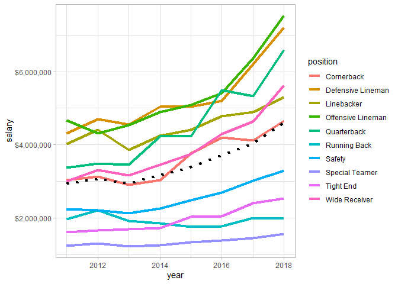
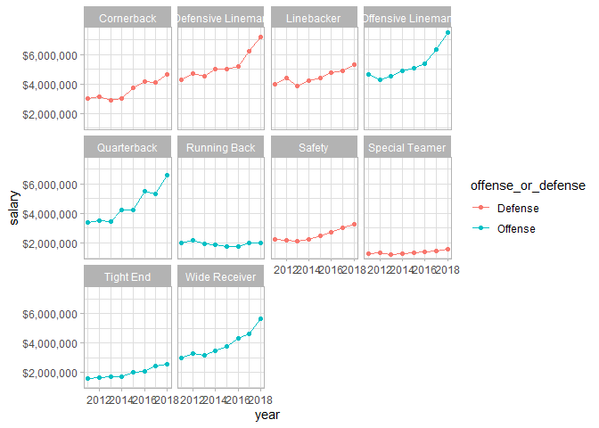
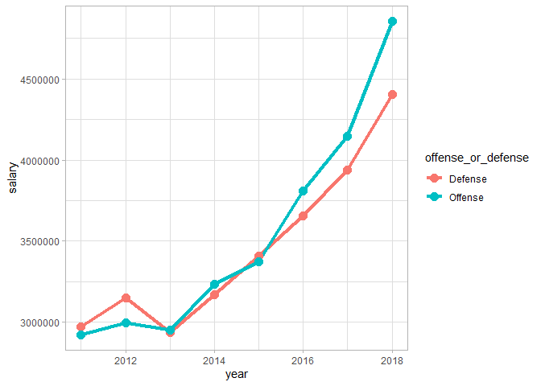

  - [Which positions make the most?](#which-positions-make-the-most)
  - [How are salaries trending over
    time?](#how-are-salaries-trending-over-time)

``` r
library(rlang)
library(tidyverse)
library(here)
library(readxl)
library(scales)
```

``` r
theme_set(theme_light())
```

``` r
nfl_salaries_raw <- read_xlsx(here("nfl-salaries", "nfl_salaries.xlsx"))

nfl_salaries <- read_xlsx(here("nfl-salaries", "nfl_salaries.xlsx")) %>% 
  pivot_longer(-year, names_to = "position", values_to = "salary") %>% 
  mutate(offense_or_defense = case_when(position %in% c("Offensive Lineman",
                                                        "Quarterback",
                                                        "Wide Receiver",
                                                        "Tight End",
                                                        "Running Back") ~ "Offense",
                                        TRUE ~ "Defense"))
```

-----

# Which positions make the most?

``` r
nfl_salaries %>% 
  group_by(position, offense_or_defense) %>% 
  summarise(salary = mean(salary, na.rm = TRUE)) %>% 
  ungroup() %>% 
  mutate(position = fct_reorder(position, salary)) %>% 
  ggplot(aes(position, salary, fill = offense_or_defense)) + 
  geom_col() +
  scale_y_continuous(labels = dollar_format()) +
  coord_flip() +
  labs(title = "Average salary from 2011-2018", 
       subtitle = "",
       x = "",
       y = "Salary") 
```

<!-- -->

-----

# How are salaries trending over time?

``` r
positional_trends <- nfl_salaries %>% 
  group_by(year, position, offense_or_defense) %>% 
  summarise(salary = mean(salary, na.rm = TRUE)) 
```

``` r
overall_trend <- nfl_salaries %>% 
  group_by(year, offense_or_defense) %>% 
  summarise(salary = mean(salary, na.rm = TRUE))
```

``` r
ggplot() +
  geom_line(data = positional_trends, 
            mapping = aes(year, salary, color = position), 
            size = 1.5
            ) +
  geom_point(data = positional_trends, 
             mapping = aes(year, salary, color = position), 
             size = 3.0
            ) +
  geom_path(data = overall_trend, 
            mapping = aes(year, salary), 
            linetype = "dashed",
            size = 1.5
            ) +
  scale_y_continuous(label = dollar_format()) +
  labs(title = "Salary trends over time",
       x = "Year",
       y = "Average salary")
```

<!-- -->

And another way to show that same info.

``` r
positional_trends %>% 
  ggplot(aes(year, salary, color = offense_or_defense)) + 
  geom_line() +
  geom_point() + 
  facet_wrap(~ position) +
  scale_y_continuous(labels = dollar_format())
```

<!-- -->

Grouped by offense and defense.

``` r
positional_trends %>% 
  group_by(year, offense_or_defense) %>% 
  summarise(salary = mean(salary)) %>% 
  ggplot(aes(year, salary, color = offense_or_defense)) +
  geom_path(size = 1.5) + 
  geom_point(size = 3.5)
```

<!-- -->

-----
