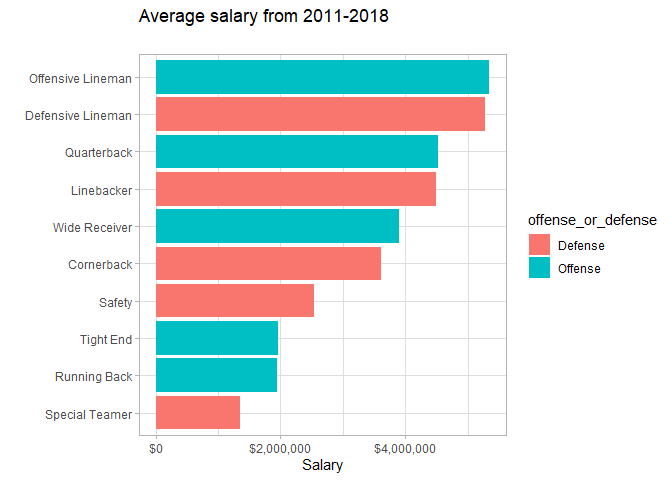
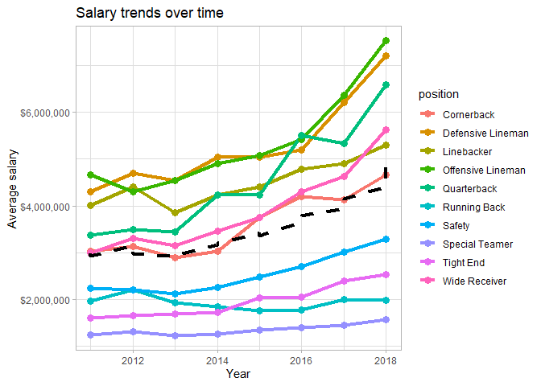

  - [Which positions make the most?](#which-positions-make-the-most)
  - [How are salaries trending over time for different
    positions?](#how-are-salaries-trending-over-time-for-different-positions)
  - [How is the trend different for offensive vs defensive
    players?](#how-is-the-trend-different-for-offensive-vs-defensive-players)
  - [](#section)

``` r
library(tidyverse)
```

    ## -- Attaching packages ------------------------------------------------------------------ tidyverse 1.2.1 --

    ## v ggplot2 3.2.1     v purrr   0.3.3
    ## v tibble  2.1.3     v dplyr   0.8.3
    ## v tidyr   1.0.0     v stringr 1.4.0
    ## v readr   1.3.1     v forcats 0.4.0

    ## -- Conflicts --------------------------------------------------------------------- tidyverse_conflicts() --
    ## x dplyr::filter() masks stats::filter()
    ## x dplyr::lag()    masks stats::lag()

``` r
library(here)
```

    ## here() starts at D:/Documents/Learning/tidy-tuesdays

``` r
library(readxl)
library(scales)
```

    ## 
    ## Attaching package: 'scales'

    ## The following object is masked from 'package:purrr':
    ## 
    ##     discard

    ## The following object is masked from 'package:readr':
    ## 
    ##     col_factor

``` r
theme_set(theme_light())
```

``` r
nfl_salaries_raw <- read_xlsx(here("nfl-salaries", "nfl_salaries.xlsx"))

nfl_salaries <- read_xlsx(here("nfl-salaries", "nfl_salaries.xlsx")) %>% 
  pivot_longer(-year, names_to = "position", values_to = "salary")
```

-----

# Which positions make the most?

``` r
nfl_salaries %>% 
  group_by(position) %>% 
  summarise(salary = mean(salary, na.rm = TRUE)) %>% 
  mutate(position = fct_reorder(position, salary)) %>% 
  ggplot(aes(position, salary, fill = position)) + 
  geom_col() +
  scale_y_continuous(labels = dollar_format()) +
  coord_flip() +
  labs(title = "Average salary from 2011-2018", 
       subtitle = "",
       x = "",
       y = "Salary") +
  theme(legend.position = "none")
```

<!-- -->

-----

# How are salaries trending over time for different positions?

``` r
positional_trends <- nfl_salaries %>% 
  group_by(year, position) %>% 
  summarise(salary = mean(salary, na.rm = TRUE)) 
```

``` r
overall_trend <- nfl_salaries %>% 
  group_by(year) %>% 
  summarise(salary = mean(salary, na.rm = TRUE))
```

``` r
ggplot() +
  geom_line(data = positional_trends, 
            mapping = aes(year, salary, color = position), 
            size = 1.5
            ) +
  geom_path(data = overall_trend, 
            mapping = aes(year, salary), 
            linetype = "dotted",
            size = 1.5
            ) +
  scale_y_continuous(label = dollar_format())
```

<!-- -->

-----

# How is the trend different for offensive vs defensive players?

-----

#
