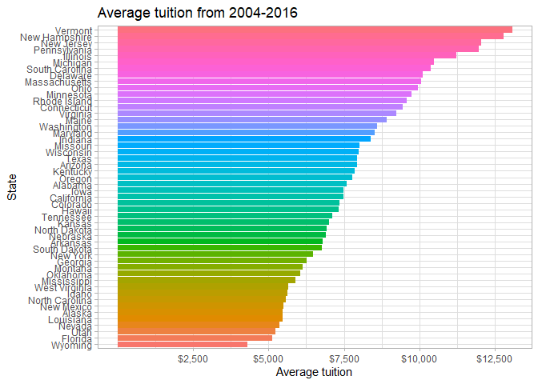
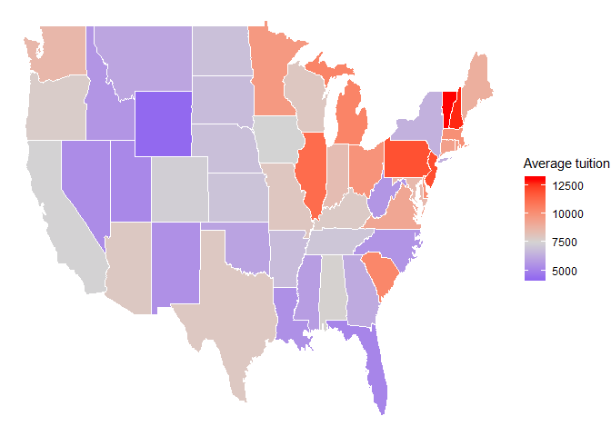

Analyzing Tidy Tuesday US Avg Tuition Dataset
================

Load packages, read in data

``` r
library(tidyverse)
```

    ## -- Attaching packages --------------------------------------------------------------------- tidyverse 1.2.1 --

    ## v ggplot2 3.2.1     v purrr   0.3.3
    ## v tibble  2.1.3     v dplyr   0.8.3
    ## v tidyr   1.0.0     v stringr 1.4.0
    ## v readr   1.3.1     v forcats 0.4.0

    ## -- Conflicts ------------------------------------------------------------------------ tidyverse_conflicts() --
    ## x dplyr::filter() masks stats::filter()
    ## x dplyr::lag()    masks stats::lag()

``` r
library(here)
```

    ## here() starts at D:/Documents/Learning/tidy-tuesdays

``` r
library(scales)
```

    ## 
    ## Attaching package: 'scales'

    ## The following object is masked from 'package:purrr':
    ## 
    ##     discard

    ## The following object is masked from 'package:readr':
    ## 
    ##     col_factor

``` r
library(readxl)
library(mapdata)
```

    ## Loading required package: maps

    ## 
    ## Attaching package: 'maps'

    ## The following object is masked from 'package:purrr':
    ## 
    ##     map

``` r
library(maptools)
```

    ## Loading required package: sp

    ## Checking rgeos availability: FALSE
    ##      Note: when rgeos is not available, polygon geometry     computations in maptools depend on gpclib,
    ##      which has a restricted licence. It is disabled by default;
    ##      to enable gpclib, type gpclibPermit()

``` r
tuition <- readxl::read_xlsx(here("us-avg-tuition", "us_avg_tuition.xlsx")) %>% 
  rename(state = State)
```

Wide to long

``` r
tuition <- tuition %>% 
  pivot_longer(cols = -state, names_to = "year", values_to = "avg_tuition")
```

-----

How does the average tuition look for each state over the entire period
of time?

``` r
tuition_all_years <- tuition %>% 
  group_by(state) %>% 
  summarise(avg_tuition = mean(avg_tuition))
```

``` r
tuition_all_years %>% 
  mutate(state = fct_reorder(state, avg_tuition)) %>% 
  ggplot(aes(state, avg_tuition)) +
  geom_col(aes(fill = state)) +
  scale_y_continuous(breaks = c(2500, 5000, 7500, 10000, 12500), labels = dollar_format()) +
  coord_flip() +
  labs(title = "Average tuition from 2004-2016",
       x = "State",
       y = "Average tuition") +
  theme(legend.position = "none")
```

<!-- -->

-----

How does the average tuition look in different regions of the country?

``` r
us_map <- map_data("state")
```

``` r
#theme_set(theme_minimal())

us_map %>% 
  mutate(region = str_to_title(region)) %>% 
  left_join(tuition_all_years, by = c("region" = "state")) %>% 
  ggplot(aes(long, lat)) +
  geom_polygon(aes(group = group, fill = avg_tuition), color = "white") +
  scale_fill_gradient2(low = "blue", mid = "lightgrey", high = "red", midpoint = 7500, name = "Average tuition") +
  theme(legend.position = "none",
        legend.title = element_text("Average tuition")) +
  theme_void()
```

<!-- -->

As the bar chart suggested, the highest tuition schools are in the
northeast and the lowest tuition schools are out west and in the south.

-----
